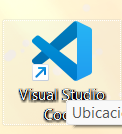
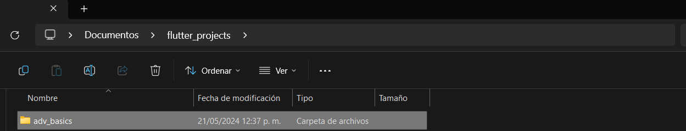
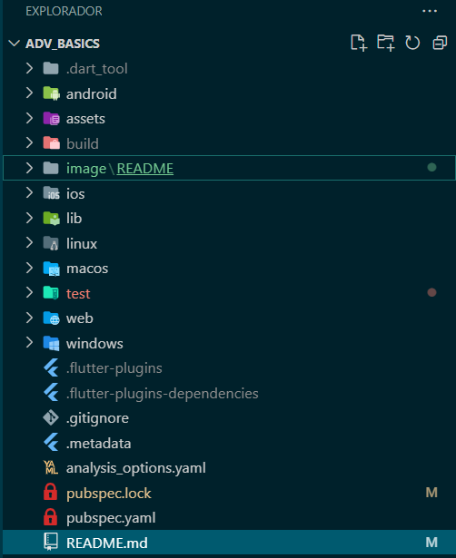
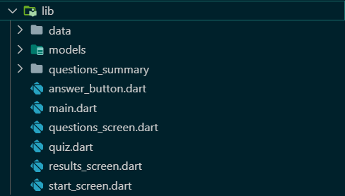
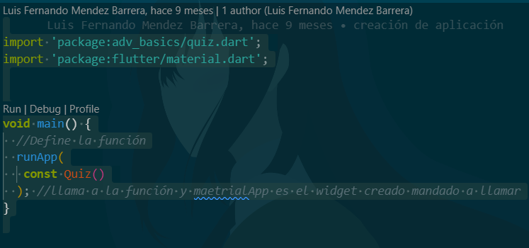
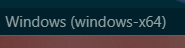
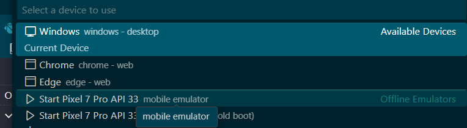
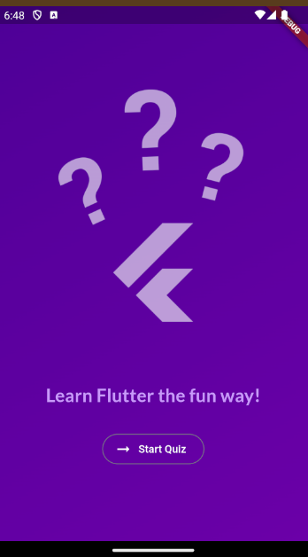
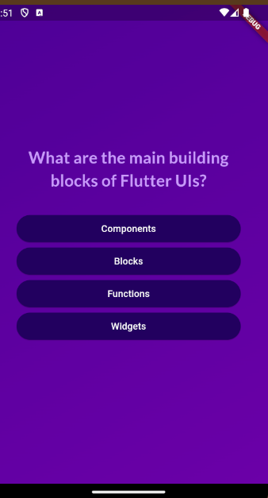
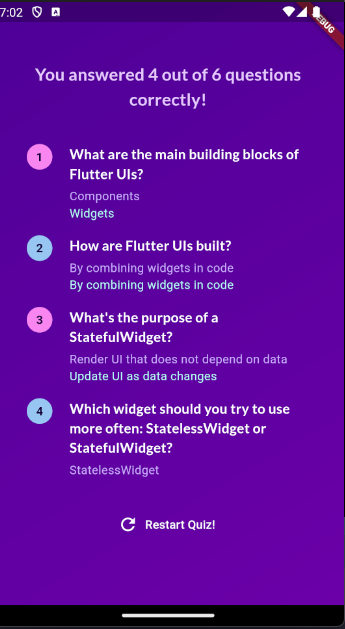

# **Adv_Basics**

Aplicación que permite hacer preguntas de selección multiple y visualizar respuestas correctas e incorrectas ya que esta es la primera aplicación basada en las practicas que se han realizado durante el curso de flutter

## Descarga e instalación.

Ejecutar los siguientes comandos.

Paso 1: Clonar el repositorio.

```nginx
git clone https://github.com/LuisFer27/adv_basics.git

```

Paso 2 :Abrir visual studio code.



Paso 3 seleccionar la carpeta en donde se guardo el repositorio en la opción  archivo y abrir carpeta.


se selecciona la carpeta en donde esta ubicado el repositorio ya que en este caso esta almacenado en documentos pero puede variar según el lugar en de lo tengas descargado.



Paso 4  una vez abierta la carpeta nos apareceran todas estas carpetas sin embargo la que nos interesa es la de lib en donde se alamcena todo los archivos dart para la ejecución de la aplicación.



Paso 5 abriremos la carpeta lib y nos dirigiremos al archivo main .dart.



abrimos el archivo main.dart y se nos visualizara de esta forma ya que al ser la primera practica se ve de esta forma .

```dart

import 'package:adv_basics/quiz.dart';
import 'package:flutter/material.dart';


void main() {
  //Define la función
  runApp(
   const Quiz()
  ); //llama a la función y maetrialApp es el widget creado mandado a llamar
}


```

en este caso en el editor le daremos click en run.



depende del dispositivo que dispongamos este se ejecutar si no podemos cambiarlo abajo de nuestro editor.



y escoger nuestro dispositivo principalmente movil ya que en este caso podemos seleccionar movil o virtual como en este ejemplo.



## Funcionalidad.



Pantalla inicial se muestra una imagen conformado con un fondo de color purpura y con letras adaptadas de acuerdo al color de la aplicación .

Botón start quiz empieza la serie de preguntas aleatoria ya que estas estan conformadas por un archivo json y una funcion que permite seleccionar las preguntas e iniciar con cualquiera.

Pantalla de preguntas:Se visualizan las preguntas de el archivo json ya que estas se caracterizan por el simbolo de interrogación .



Lista de botones de respuestas: se visualizan en una lista de botones con una respuesta ya que para avanzar a la siguiente pagina de preguntas hay que seleccionar una respuesta ya que cada una se alamacena en un arreglo.

Pantalla de respuestas : se muestran la pantalla con las preguntas de cada pagina que se han alamcenado de igual forma se muestran las respuestas seleccionadas en un color azul y las correctas en un color transparente.



Botón Restart Quiz!: se reinicia la aplicación y regresa a la pantalla de inicio ya que estos datos se borran
